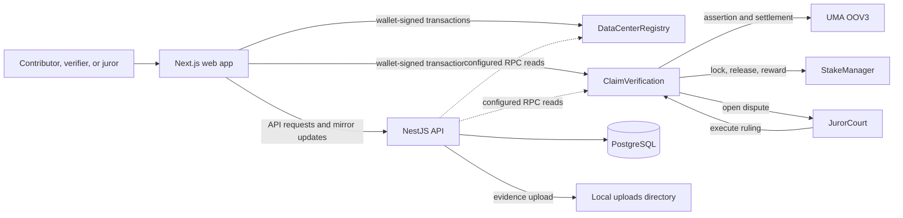
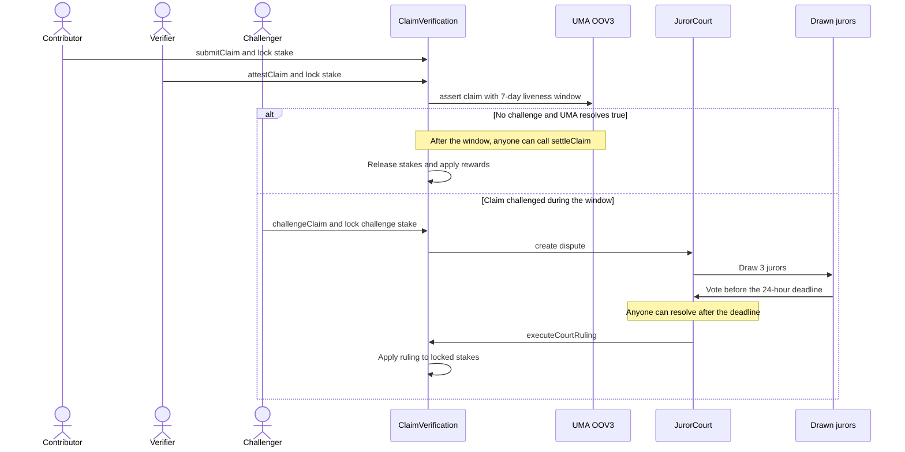

# Project Scope and Architecture

This page describes what is implemented in this repository today. It is a testnet MVP, not a production security or availability claim.

## Current MVP

- **Data centers:** Solidity registry contracts store data center records; the web app presents them on a map and detail pages.
- **Claims:** Contributors submit a fact and proof hash with a USDC stake. A verifier stakes USDC and posts an assertion through UMA Optimistic Oracle V3 (OOV3).
- **Disputes:** A challenge during the OOV3 window opens the project's `JurorCourt`. Three jurors are drawn, vote during a 24-hour window, and the court executes the ruling on `ClaimVerification`.
- **Web and API:** The Next.js app uses a wallet for contract transactions. The NestJS API serves application data and stores mirror records after successful wallet transactions; on-chain claim state is canonical.
- **Uploads:** The API currently writes uploaded evidence to local disk. This is not durable or shared object storage.

## Component Map

## Claim Lifecycle

An OOV3 assertion can also be disputed directly; the contract callback attempts to open a court dispute. If there are not enough registered jurors, that callback leaves the claim attested while the OOV3 dispute remains outstanding.

## Scope and Trust Boundaries

| Area | Current behavior | Boundary or limitation |
|---|---|---|
| Network | Ethereum Sepolia (chain ID `11155111`) | Testnet only; do not treat test deployments or balances as production funds. |
| Jury selection | Three jurors; 24-hour voting window; minority voters can be slashed by 50% | Selection uses blockhash-based pseudo-randomness, explicitly unsuitable for production. |
| Contract administration | Claim decisions and settlement calls are permissionless | Contract owners can change parameters and wire the court; this is not a trustless upgrade/configuration model. |
| API data | Claim and dispute records mirror wallet transactions | These records can lag or diverge; check the contract state for canonical claim status. |
| Evidence files | Uploads are written to the backend's local `uploads/` directory | Local disk is not durable shared storage and needs replacement for a multi-instance deployment. |
| Product scope | Data-center records, claims, verification, staking, and disputes | Paid enterprise access, investment marketplace, custom token, and automated data ingestion are not part of the current implemented flow. |

## Repository Areas

| Path | Responsibility |
|---|---|
| `frontend/` | Next.js app, map, wallet interactions, and user workflows |
| `backend/` | NestJS API, authentication, database mirrors, and uploads |
| `data_centers/` | Foundry contracts, deployment script, and Solidity tests |
| `docs/` | Curated project scope and architecture documentation |

Use [SETUP_GUIDE.md](../SETUP_GUIDE.md) to configure local development and testnet deployment. Copy environment templates as needed, keep real `.env` files and private keys out of Git, and never reuse Anvil's published development key on a live network.